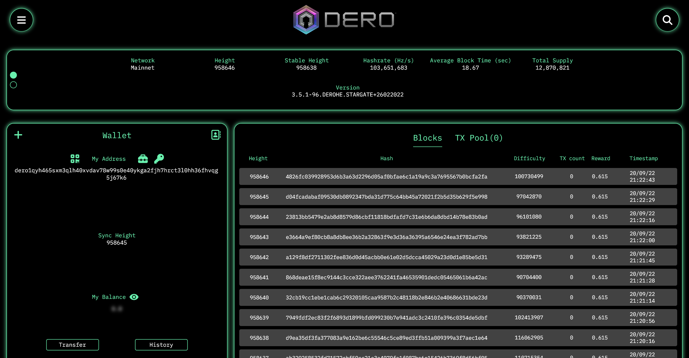

# Dero Control Interface

Interface to interact with DERO network (derod and wallet) via RPC.



## Requirement

Follow the link below to install Flutter.

[Flutter SDK](https://docs.flutter.dev/get-started/install)

You will find next all necessary requirements to build an executable for the platform of your choice (Windows, Linux, MacOS).

[Desktop support for Flutter](https://docs.flutter.dev/development/platform-integration/desktop)

## Installation

Clone the repository and then move to working directory.

```
git clone https://github.com/Ez3kiel-dev/dero-control-interface.git
cd dero_control_interface/
```

Finally build and run the program for your desire platform.

```
flutter run --release -d windows
```
```
flutter run --release -d macos
```
```
flutter run --release -d linux
```

## Getting Started

* Start derod in your terminal, it can take a lot of time if it's your first time and you don't have a copy of the blockchain (use `--fastsync` option to obtain a prune version of the blockchain).
* Open the cli wallet in another tab `.\dero-wallet-cli-windows-amd64.exe --rpc-server --rpc-login=username:password` (example with Windows here).

    `--rpc-server` wallet option is mandatory, to allow the Dero Control Interface to communicate with your wallet.

    `--rpc-login` wallet option is optional but strongly recommended for security purposes.
* Run the Dero Control Interface App.
  
    Default RPC address are `127.0.0.1:10102` for derod and `127.0.0.1:10103` for wallet cli if both are run locally.
    


## Features

* Monitor the Dero network by getting information from derod (general, mining, explorer)
* Control your wallet remotely (transfer with secret message, integrated address, history, Dero NameService SC)
* Search a block, tx, smart contract or a named address


## Donations

If you like my work and want to support me, donations are greatly appreciated :)

Send any amount to `dero1qy5a6wk2r9mq3e5kagku4kdrhq407qhvht8qke5sxpm9u8lqmph3vqgl3nz8t` or use my named address `Ez3kiel`.

Thanks in advance!
